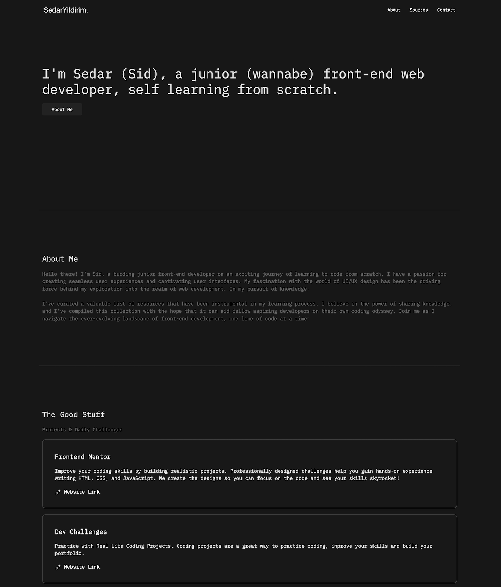

<!-- PROJECT LOGO -->
 

    
  </a>
   
   

[![Contributors][contributors-shield]][contributors-url]
[![Forks][forks-shield]][forks-url]
[![Stargazers][stars-shield]][stars-url]
[![MIT License][license-shield]][license-url]

<h3 align="center">Junior Developer Resources</h3>

  

    a small list of resources i've curated while self learning to code which may help others
     
     
     
    <a href="https://sedaryildirim.github.io/junior-developer-resources/">View Site</a>
    ·
    <a href="https://github.com/sedaryildirim/junior-developer-resources/issues">Report Bug</a>
    ·
    <a href="https://github.com/sedaryildirim/junior-developer-resources/issues">Request Feature</a>
  

<!-- SCREENSHOT -->
## Screenshot

    

<!-- LIST -->
## Resources

- Projects - a list of websites that offer small bitesize projects covering HTML, CSS & JS
  - [Front End Mentor Projects](https://www.frontendmentor.io/)
  - [Dev Challenges Projects](https://devchallenges.io/) 
  - [Front End Projects](https://www.frontendpractice.com/#projects)
  - [100 Days CSS Challenge](https://100dayscss.com/)
  - [Daily UI](https://www.dailyui.co/)
- Courses - Zero to Hero-esque courses
  - [The Odin Project](https://www.theodinproject.com/home)
  - [Modern Java Script by Jonas Schmedtmann](https://www.udemy.com/course/the-complete-javascript-course/)
  - [Modern Java Script by Shaun Pelling](https://www.udemy.com/course/modern-javascript-from-novice-to-ninja/)
  - [Web Developer Boot Camp by Colt Steele](https://www.udemy.com/course/the-web-developer-bootcamp/)
  - [Web Developer Boot Camp by Angela Yu](https://www.udemy.com/course/the-complete-web-development-bootcamp/)
- YouTube - List of youtubers i watch for tutorials and help
  - [Kevin Powell](https://www.youtube.com/kevinpowell)
  - [Florin Pop](https://www.youtube.com/channel/UCeU-1X402kT-JlLdAitxSMA)
  - [The Net Ninja](https://www.youtube.com/channel/UCW5YeuERMmlnqo4oq8vwUpg)
  - [Bedimcode](https://www.youtube.com/channel/UCgkDs77BoEhMIgRUB4MKrtQ)
- Tools - General list of tools covering icons, shields, fonts, color schemes and such
  - [Simple Icons](https://simpleicons.org/)
  - [Github Shields](https://shields.io/)
  - [Form Mailer](https://formspark.io/)
  - [Netlify](https://www.netlify.com/)
  - [Box Icons](https://boxicons.com/)
  - [Flat Icons](https://www.flaticon.com/)
  - [Icons 8](https://icons8.com/)
  - [Tabler Icons](https://tablericons.com/)
  - [Icon Scout](https://iconscout.com/)
  - [Font Awesome](https://fontawesome.com/)
  - [Pocoloco](https://pocoloco.io/)
  - [Dopely Colors](https://colors.dopely.top/)
  - [UI Faces](https://uifaces.co/)
  - [Clippy](https://bennettfeely.com/clippy/)
  - [Remove BG](https://www.remove.bg/)
  - [Image Compressor](https://imagecompressor.com/)
- Cheat Sheets - list of quick cheat sheets to visualise grid and flexbox for easier understanding
  - [CSS Garden](https://cssgridgarden.com/)
  - [Flexbox Froggy](https://flexboxfroggy.com/)
  - [Malven Grid](https://grid.malven.co/)
  - [Malven Flexbox](https://flexbox.malven.co/)
  - [CSS Grid Generator](https://grid.layoutit.com/)
  - [Flexbox Generator](https://flexbox.help/)
  - [Flexbox Tricks](https://css-tricks.com/snippets/css/a-guide-to-flexbox/)
- Royalty Free Images / Videos
  - [Unsplash](https://unsplash.com/)
  - [Pexels](https://www.pexels.com/)
  - [Coverr](https://coverr.co/)
  - [Undraw](https://undraw.co/)

(<a href="#readme-top">back to top</a>)

<!-- CONTRIBUTING -->
## Contributing

Contributions are what make the open source community such an amazing place to learn, inspire, and create. Any contributions you make are **greatly appreciated**.

If you have a suggestion that would make this better, please fork the repo and create a pull request. You can also simply open an issue with the tag "enhancement".
Don't forget to give the project a star! Thanks again!

1. Fork the Project
2. Create your Feature Branch (`git checkout -b feature/Suggestion`)
3. Commit your Changes (`git commit -m 'Add some Suggestion'`)
4. Push to the Branch (`git push origin feature/Suggestion`)
5. Open a Pull Request

(<a href="#readme-top">back to top</a>)

<!-- LICENSE -->
## License

Distributed under the MIT License. See `LICENSE.txt` for more information.

(<a href="#readme-top">back to top</a>)

<!-- MARKDOWN LINKS & IMAGES -->
<!-- https://www.markdownguide.org/basic-syntax/#reference-style-links -->
[contributors-shield]: https://img.shields.io/github/contributors/sedaryildirim/junior-developer-resources.svg?style=for-the-badge
[contributors-url]: https://github.com/sedaryildirim/junior-developer-resources/graphs/contributors
[forks-shield]: https://img.shields.io/github/forks/sedaryildirim/junior-developer-resources.svg?style=for-the-badge
[forks-url]: https://github.com/sedaryildirim/junior-developer-resources/network/members
[stars-shield]: https://img.shields.io/github/stars/sedaryildirim/junior-developer-resources.svg?style=for-the-badge
[stars-url]: https://github.com/sedaryildirim/junior-developer-resources/stargazers
[license-shield]: https://img.shields.io/github/license/sedaryildirim/junior-developer-resources.svg?style=for-the-badge
[license-url]: https://github.com/sedaryildirim/junior-developer-resources/blob/main/LICENSE.txt
[product-screenshot]: imgs/screenshot.png
